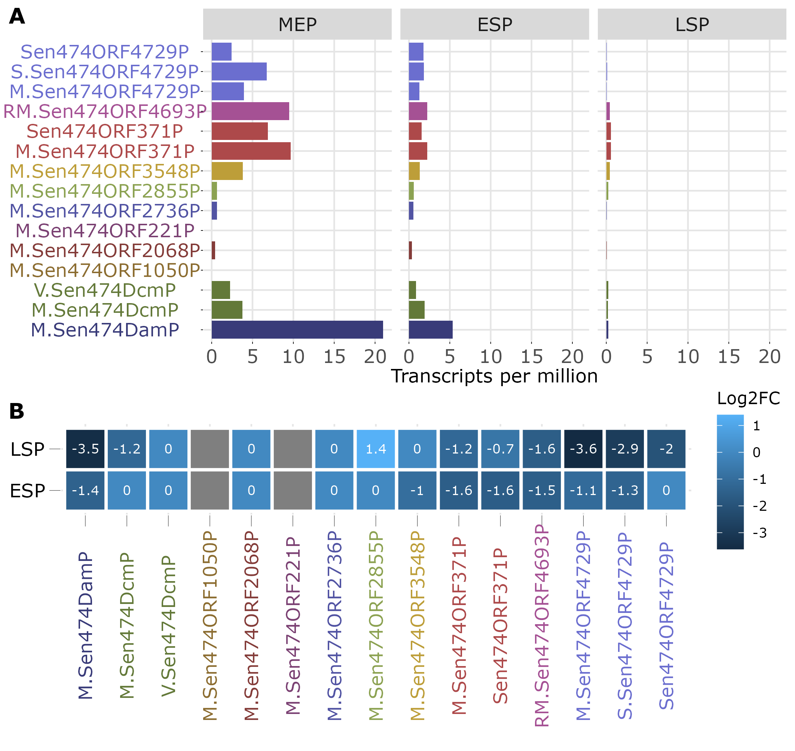
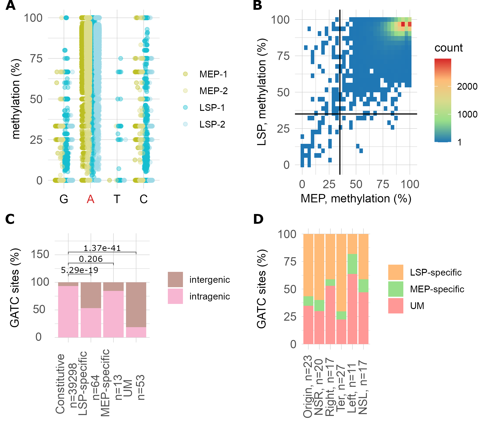
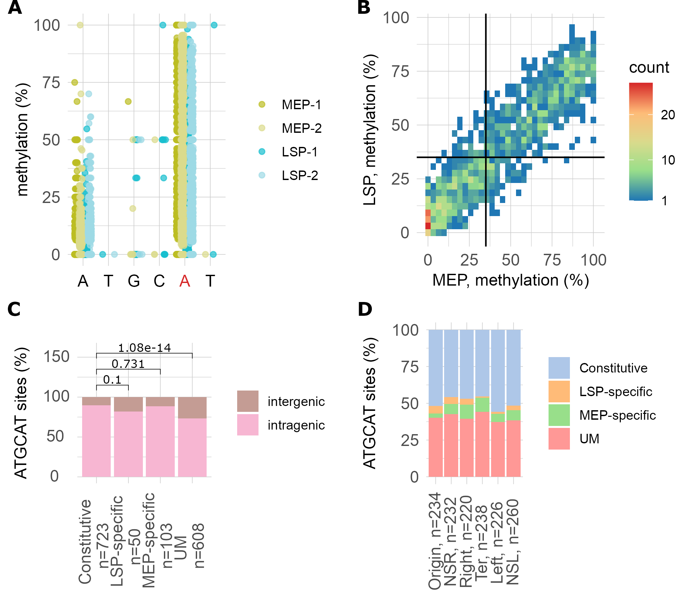
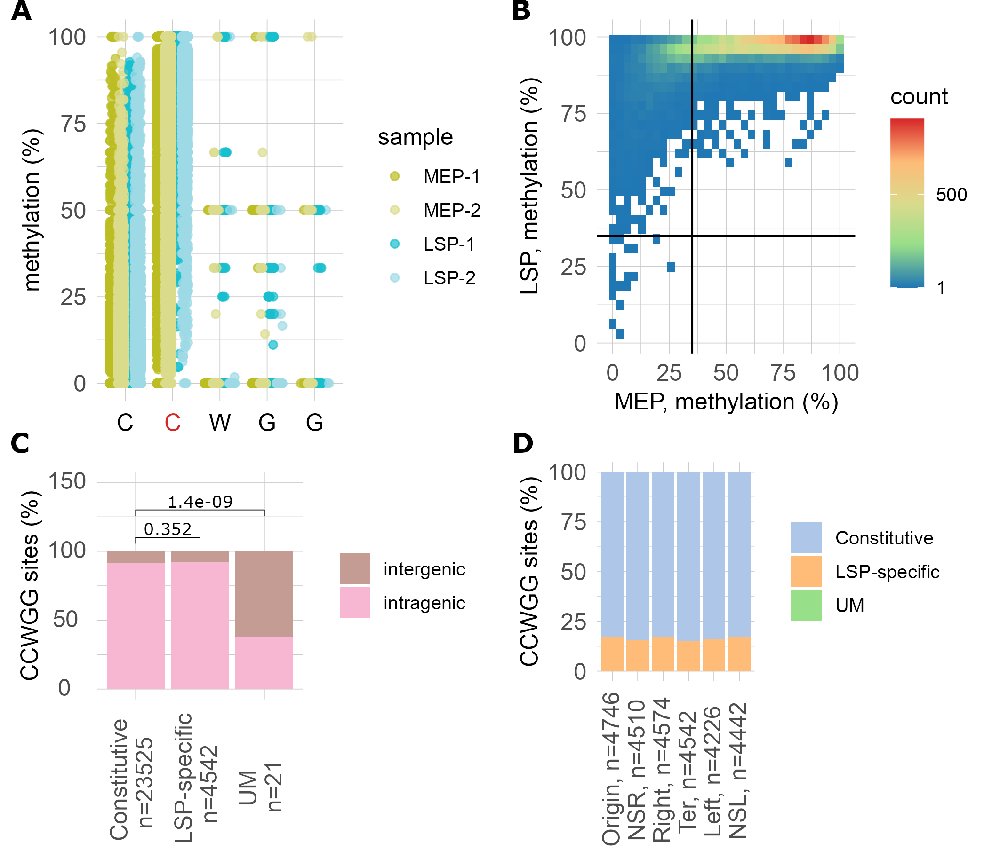
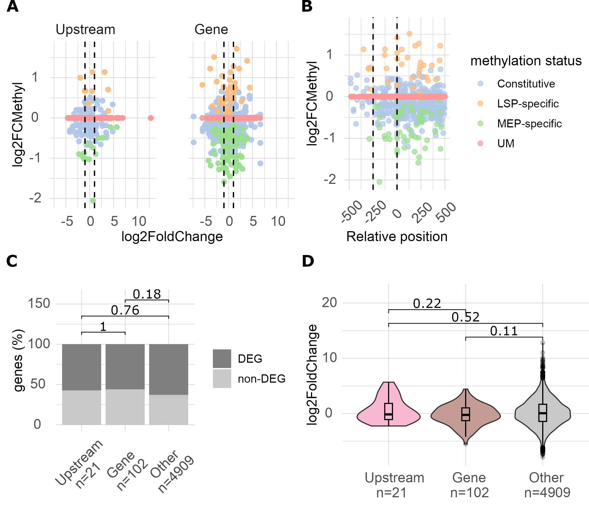
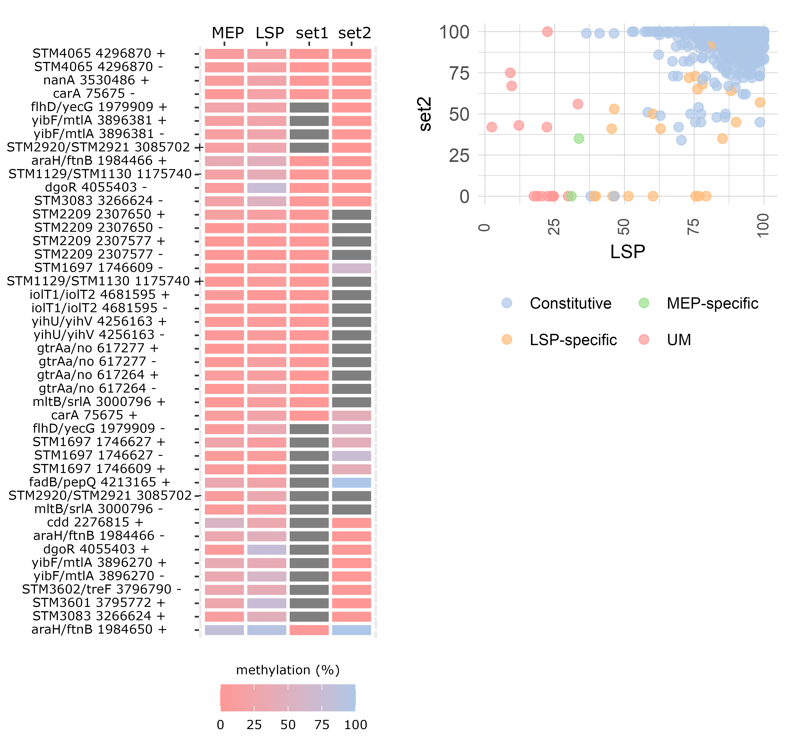
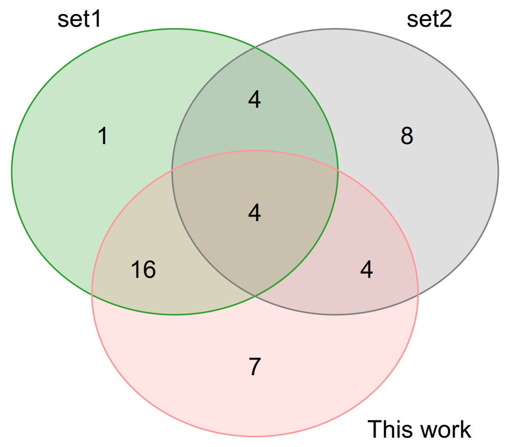
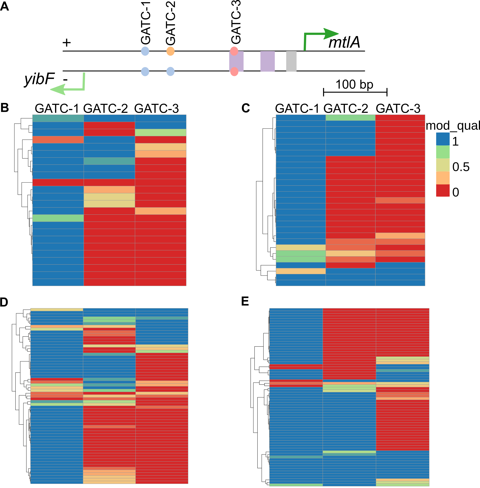

## Figure 1 

Fig 1. Gene expression of R-M genes at different growth phases (two biological replicas for each phase). MEP-mid exponential phase, ESP-early stationary phase, LSP-late stationary phase. A. Transcripts per million (TPM) B. DESeq2 results, MEP was used as a reference. Components of the same R-M system are coloured in the same colour. Log2FC are shown only if pvalue adjusted <0.01. The intensity of the blue color shows Log2FC, grey shows lack of data on gene expression. 

## Figure 2

Fig 2. GATC methylation in _S. enterica_ 4/74 at different growth phases. A. Methylation percentage of bases in the GATC sites across the genome. An A in the first position is predominantly methylated (shown in red). Two samples of the Mid-exponential phase (MEP-1 and MEP-2) and two samples of the Late Stationary Phase (LSP-1 and LSP-2) are shown. B. Methylation dynamics of GATC sites (n=39,428) in a genome across growth phases. 35% methylation thresholds are shown by solid lines. C. Distribution of GATC sites by methylation status across intragenic and intergenic regions. LSP-specific and unmethylated sites (UM) are significantly enriched in intergenic regions, Fisher’s exact test, pvalue 5x10-19 and 1.37x10-41, correspondingly. D. Distribution of GATC sites across methylation status grouped by chromosome macrodomains (NSR = non-structured right, NSL = non-structured left, Ter = terminus). Constitutively methylated sites are omitted. Methylation % corresponds to the percentage of reads, where this position is methylated divided by the total number of reads in this position.  

## Figure 3

Fig 3. ATGCAT methylation in _S. enterica_ 4/74 at different growth phases. A. Methylation percentage of bases in the ATGCAT sites across the genome. The second A is methylated (shown in red). Two samples of the Mid-exponential phase (MEP-1 and MEP-2) and two samples of the Late Stationary Phase (LSP-1 and LSP-2) are shown. B. Methylation dynamics of ATGCAT sites (n=1,484) in a genome across growth phases. 35% methylation thresholds are shown by solid lines. C. Distribution of ATGCAT sites across intragenic regions and intergenic regions grouped by methylation status. Unmethylated sites (UM) are significantly enriched in intergenic regions, chi-square test, pvalue 1x10-14 D. Distribution of ATGCAT sites across methylation status grouped by chromosome macrodomain. Only chromosomal sites are shown. Methylation % corresponds to the percents of reads, where this position is methylated to the total number of reads in this position. 

## Figure 4

Fig 4. CCWGG methylation in _S. enterica_ 4/74 at different growth phases. A. Methylation percentage of bases in the CCWGG sites across the genome.  The second C is methylated (shown in red). Two samples of the Mid-exponential phase (MEP-1 and MEP-2) and two samples of the Late Stationary Phase (LSP-1 and LSP-2) are shown. B. Methylation dynamics of CCWGG sites (n=28,088) in a genome across growth phases. 35% methylation thresholds are shown by solid lines. C. Distribution of CCWGG sites across intragenic regions and intergenic regions grouped by methylation status. Unmethylated sites (UM) are significantly enriched in intergenic regions, chi-square test, pvalue =1.4x10-9 D. Distribution of CCWGG sites across methylation status grouped by chromosome macrodomain. Only chromosomal sites are shown; constitutively methylated sites are omitted. Methylation % corresponds to the percents of reads, where this position is methylated to the total number of reads in this position. 

 
## Figure 5

Fig 5. Associations between DNA methylation and gene expression changes between MEP and LSP phases for the GATC motif. A. Comparison of changes in gene expression (log₂ fold change) and changes in DNA methylation (log2FCMethyl) between LSP and MEP for sites localised in intragenic regions (left panel) and upstream regions (right panel). The thresholds for differentially expressed genes are shown as dashed lines (log₂ fold change is -1 for downregulated and +1 for upregulated genes, padj <0.05) B. Relative position of sites (+1 corresponds to the annotated start codon) and changes in DNA methylation between growth phases. Differentially methylated sites are mainly localised in the functionally important upstream area (0-250 bp), chi-square p-value < 2.2e-16. C. Qualitative comparison of differentially expressed genes (DEGs) and non-DEGs among groups defined by the presence of differentially methylated sites in upstream regions, intragenic regions, or neither. Genes with a log₂ fold change ≥ 1 or ≤ –1 and an adjusted p < 0.05 were classified as DEGs; all others were considered non-DEGs. Statistical significance was assessed using a chi-square test. D. Quantitative analysis of log₂ fold change distributions in gene expression for the same groups. Statistical significance was assessed using the Mann–Whitney–Wilcoxon test. 

## Figure 6

Fig 6. Associations between DNA methylation and gene expression changes between MEP and LSP phases for CCWGG motif. A. Comparison of changes in gene expression (log₂ fold change) and changes in DNA methylation (log2FCMethyl) between LSP and MEP for sites localised in intragenic regions (left panel) and upstream regions (right panel). The thresholds for differentially expressed genes are shown as dashed lines (log₂ fold change is -1 for downregulated and +1 for upregulated genes, padj <0.05) B. Relative position of sites (+1 corresponds to the annotated start codon) and changes in DNA methylation between growth phases. There is no statistically significant enrichment of differentially methylated CCWGG sites in the functionally important 0-250 bp upstream region (chi-square test pvalue=0.17). C. Qualitative comparison of differentially expressed genes (DEGs) and non-DEGs among groups defined by the presence of differentially methylated sites in upstream regions, intragenic regions, or neither. Genes with a log₂ fold change ≥ 1 or ≤ –1 and an adjusted p < 0.05 were classified as DEGs; all others were considered non-DEGs. Statistical significance was assessed using a chi-square test. D. Quantitative analysis of log₂ fold change distributions in gene expression for the same groups. Statistical significance was assessed using the Mann–Whitney–Wilcoxon test. 

## Figure 7

Fig 7. Associations between DNA methylation and gene expression changes between MEP and LSP phases for ATGCAT motif. A. Comparison of changes in gene expression (log₂ fold change) and changes in DNA methylation (log2FCMethyl) between LSP and MEP for sites localised in intragenic regions (left panel) and upstream regions (right panel). The thresholds for differentially expressed genes are shown as dashed lines (log₂ fold change is -1 for downregulated and +1 for upregulated genes, padj <0.05) B. Relative position of sites (+1 corresponds to the annotated start codon) and changes in DNA methylation between growth phases. C. Qualitative comparison of differentially expressed genes (DEGs) and non-DEGs among groups defined by the presence of differentially methylated sites in upstream regions, intragenic regions, or neither. Genes with a log₂ fold change ≥ 1 or ≤ –1 and an adjusted p < 0.05 were classified as DEGs; all others were considered non-DEGs. Statistical significance was assessed using a chi-square test. D. Quantitative analysis of log₂ fold change distributions in gene expression for the same groups. Statistical significance was assessed using the Mann–Whitney–Wilcoxon test. 

## Figure 8

Fig. 8. Overlap of unmethylated GATC sites in intergenic regions across three independent datasets.  (A) Methylation levels of homologous GATC sites in the chromosomal alignment of _S. enterica_ ATCC 14028s and _S. enterica_ 4/74, including sites unmethylated in at least one of the three datasets: this study, set 1 [10], and set 2 [13]. Regions labelled a–g correspond to the segments of the Venn diagram shown in panel (C).  (B) Comparison of methylation levels (%) for all homologous GATC sites between _S. enterica_ ATCC 14028s in late exponential phase, SMRT data from [13], and our LSP dataset.  (C) Venn diagram showing overlap of undermethylated GATC sites among the three datasets. 

## Figure 9

Fig 9. Methylation of GATC sites in the yibF–mtlA intergenic region (ST4-74.fa, positions 3,896,108–3,896,582). A. Organisation of the intergenic region. Transcription start sites (TSSs) are shown as arrows. GATC sites are depicted as circles, with colors indicating methylation status: blue = constitutively methylated, yellow = LSP-specific methylation, pink = unmethylated. Known transcription factor binding sites are shown as rectangles: violet = Crp binding sites, grey = FruR binding sites according to RegPrecise [28]. B. Methylation patterns in the mid-exponential phase (positive strand). C. Methylation patterns in the MEP (negative strand). MEP-2 sample, 32x is shown. D. Methylation patterns in the LSP (positive strand).  E. Methylation patterns in the LSP (negative strand). LSP-1, 124x is shown.  The heatmap shows the probability of m6A methylation at each GATC site, as determined by modkit extract-full (mod_qual column). Each row represents an individual sequencing read.  

