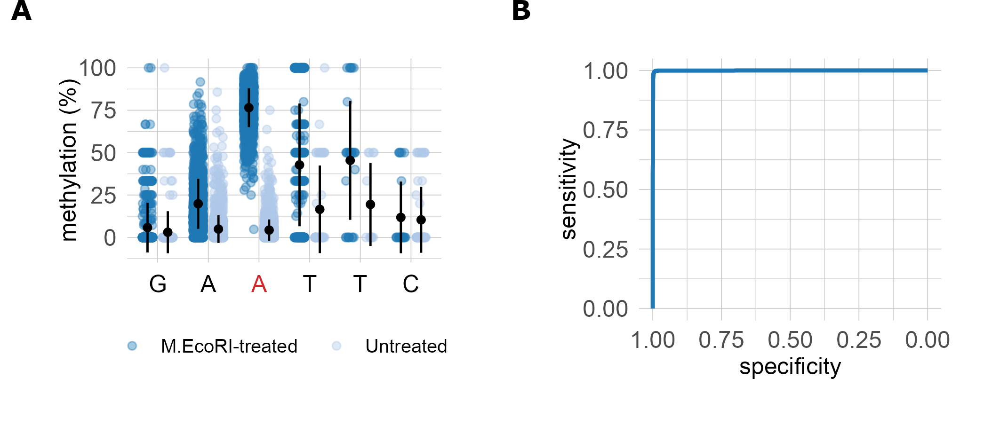
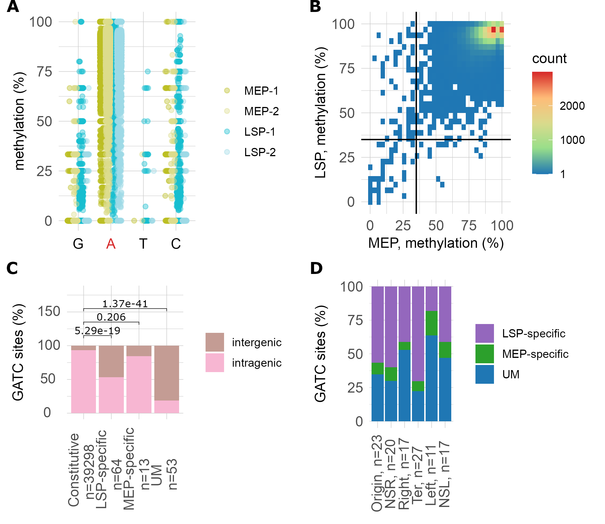
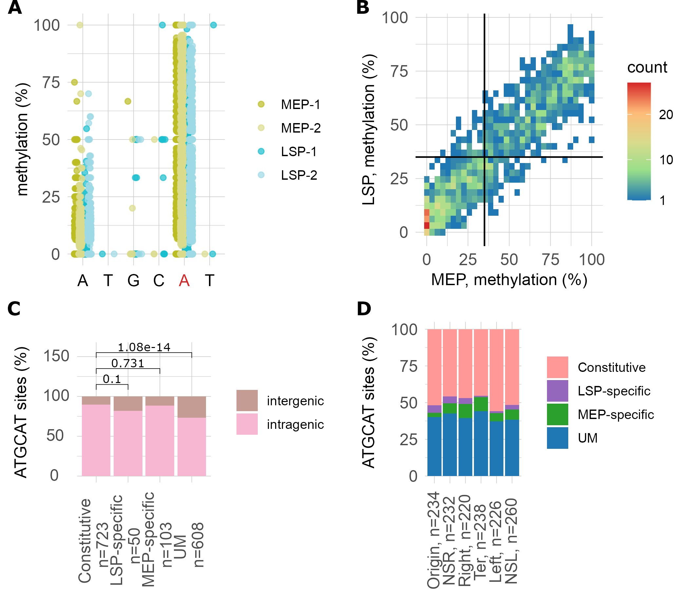
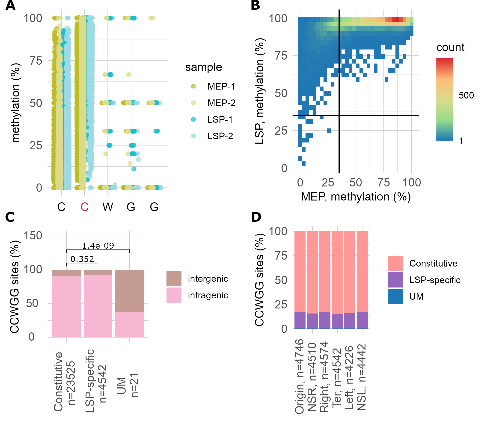
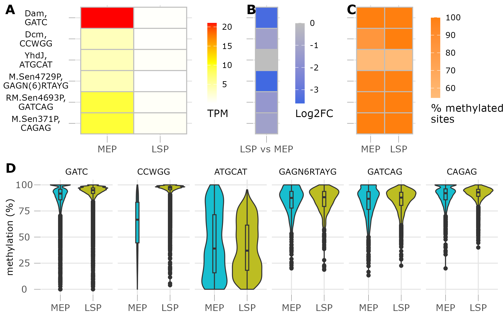
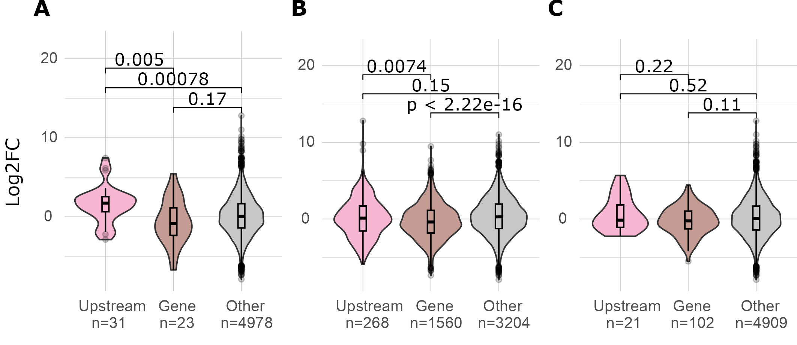
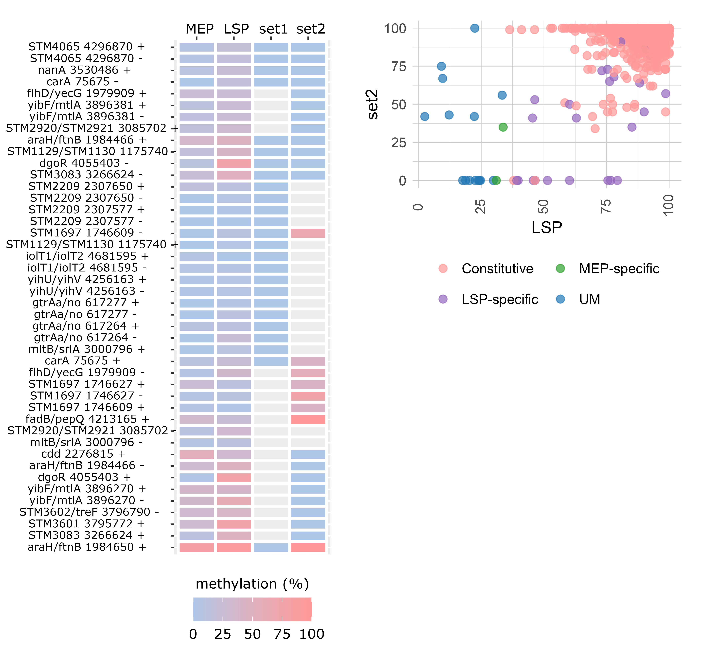
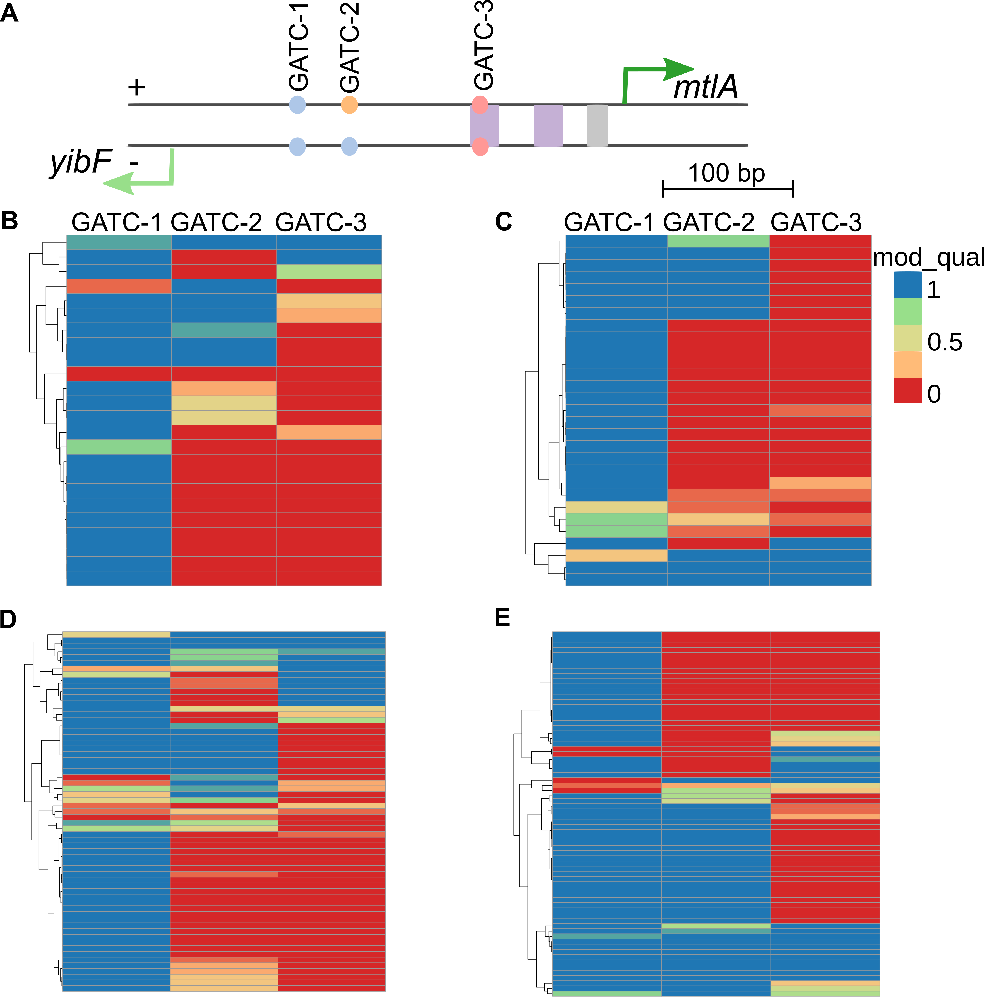

## Figure 1 

Fig 1. Comparison of M.EcoRI treated and non-treated (WT) samples of S. enterica 4/74 genomic DNA. A. Methylation % of bases of GAATTC sites in M.EcoRI treated (M.EcoRI) and non-treated (WT) samples. Individual data points are shown as jittered dots. Black pointranges indicate the mean ± standard deviation for each group.  B. ROC curve (solid blue line) based on the comparison of the methylation level of the second A (highlighted in red) in the GAATTC sequence between M.EcoRI treated and non-treated samples. Methylation percentage represents the proportion of sequencing reads containing a methylated base at a given genomic position relative to the total number of reads covering that position with the corresponding base. 
## Figure 2

Fig 2. GATC methylation in _S. enterica_ 4/74 at different growth phases. A. Methylation percentage of bases of GATC sites across the genome. An A in GATC is predominantly methylated (highlighted in red). Two samples of the Mid-Exponential Phase (MEP-1 and MEP-2) and two samples of the Late Stationary Phase (LSP-1 and LSP-2) are shown. B. Methylation dynamics of GATC sites (n=39,428) in the genome across growth phases. 35% methylation thresholds are shown by solid lines. C. Distribution of GATC sites by methylation status across intragenic and intergenic regions. LSP-specific and unmethylated sites (UM) are significantly enriched in intergenic regions, Fisher’s exact test, p-value 5×10-19 and 1.37×10-41, correspondingly. D. Distribution of GATC sites and methylation status grouped by chromosome macrodomains (NSR = non-structured right, NSL = non-structured left, Ter = terminus). Constitutively methylated sites are omitted. Methylation % corresponds to the percentage of reads, where this position is methylated divided by the total number of reads of this position.  
## Figure 3

Fig 3. ATGCAT methylation in _S. enterica_ 4/74 at different growth phases. A. Methylation percentage of bases of ATGCAT sites across the genome. The second A in ATGCAT is methylated (highlighted in red). Two samples of the Mid-Exponential Phase (MEP-1 and MEP-2) and two samples of the Late Stationary Phase (LSP-1 and LSP-2) are shown. B. Methylation dynamics of ATGCAT sites (n=1,484) in a genome across growth phases. 35% methylation thresholds are shown by solid lines. C. Distribution of ATGCAT sites across intragenic regions and intergenic regions grouped by methylation status. Unmethylated sites (UM) are significantly enriched in intergenic regions, chi-square test, p-value 1×10-14 D. Distribution of ATGCAT sites and methylation status grouped by chromosome macrodomain. Only chromosomal sites are shown. Methylation % corresponds to the percents of reads, where this position is methylated to the total number of reads in this position. 
## Figure 4

Fig 4. CCWGG methylation in _S. enterica_ 4/74 at different growth phases. A. Methylation percentage of bases in the CCWGG sites across the genome.  The second C is methylated (shown in red). Two samples of the Mid-exponential phase (MEP-1 and MEP-2) and two samples of the Late Stationary Phase (LSP-1 and LSP-2) are shown. B. Methylation dynamics of CCWGG sites (n=28,088) in a genome across growth phases. 35% methylation thresholds are shown by solid lines. C. Distribution of CCWGG sites across intragenic regions and intergenic regions grouped by methylation status. Unmethylated sites (UM) are significantly enriched in intergenic regions, chi-square test, pvalue =1.4x10-9 D. Distribution of CCWGG sites across methylation status grouped by chromosome macrodomain. Only chromosomal sites are shown; constitutively methylated sites are omitted. Methylation % corresponds to the percents of reads, where this position is methylated to the total number of reads in this position. 

 
## Figure 5

Fig. 5. Growth phase-dependent expression of MTase genes and methylation of their cognate motifs. A. Heatmap of MTase gene expression (transcripts per million, TPM) across growth phases (mean of two biological replicates). MEP, mid-exponential phase; LSP, late stationary phase.  The first three MTases correspond to solitary MTases, whereas the subsequent three are components of R-M systems. B. Differential expression analysis of MTase genes relative to MEP using DESeq2. Log₂ fold changes (Log2FC) are shown for genes with significant differential expression (adjusted p < 0.05). C. Percentage of sites across the genome classified as methylated at each growth phase. Sites with a methylation level ≥35% were considered methylated. D. Distribution of methylation levels (%) at the modified base for each MTase recognition motif across growth phases. 
## Figure 6

Fig. 6. Associations between DNA methylation and gene expression changes across growth phases.  Quantitative analysis of log₂ fold change (Log2FC) in gene expression between LSP and MEP for genes associated with condition-specific methylated sites located in upstream regions (Upstream), intragenic regions (Gene), all remaining genes (Others) were used as a control. A. GATC motifs; B. CCWGG motifs; C. ATGCAT motifs. Statistical significance was assessed using the Mann–Whitney–Wilcoxon test.

## Figure 7 

Fig. 7. Overlap of unmethylated GATC sites in intergenic regions across three independent datasets. A. Methylation levels of homologous GATC sites in the chromosomal alignment of S. enterica ATCC 14028s and S. enterica 4/74, including sites unmethylated in at least one of the three datasets: this study (MEP/LSP), set 1 [13], and set 2 [16]. Regions labelled a–g correspond to the segments of the Venn diagram shown in panel (C). Grey colour indicates sites for which methylation status was not detected in the corresponding study. B. Comparison of methylation levels (%) for all homologous GATC sites between S. enterica ATCC 14028s in late exponential phase, SMRT data from [16], and our LSP dataset. UM, unmethylated sites. C. Venn diagram showing overlap of undermethylated GATC sites among the three datasets. 
## Figure 9

Fig 8. Methylation of GATC sites in the yibF–mtlA intergenic region (ST4-74.fa, positions 3,896,108–3,896,582). A. Organisation of the intergenic region. Transcription start sites (TSSs) are shown as arrows. GATC sites are depicted as circles, with colors indicating methylation status: blue = constitutively methylated, yellow = LSP-specific methylation, pink = unmethylated. Known transcription factor binding sites are shown as rectangles: violet = Crp binding sites, grey = FruR binding sites according to RegPrecise [30]. B. Methylation patterns in the mid-exponential phase (positive strand). C. Methylation patterns in the MEP (negative strand). MEP-2 sample, 32x is shown. D. Methylation patterns in the LSP (positive strand).  E. Methylation patterns in the LSP (negative strand). LSP-1, 124x is shown.  The heatmap shows the probability of m6A methylation at each GATC site, as determined by modkit extract-full (mod_qual column). Each row represents an individual sequencing read. 
